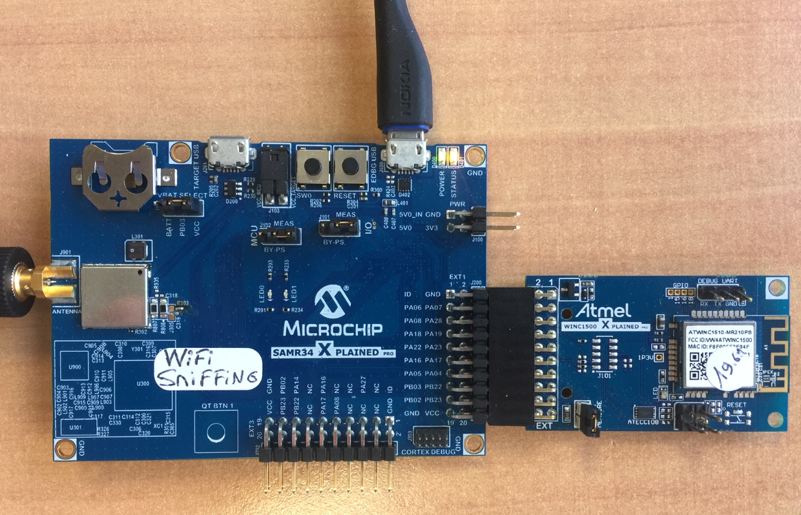
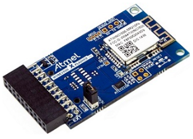
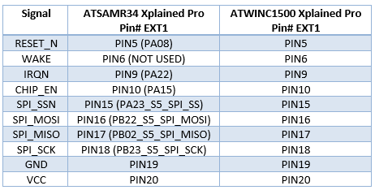
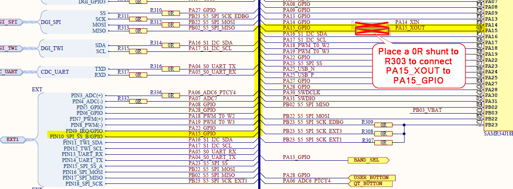
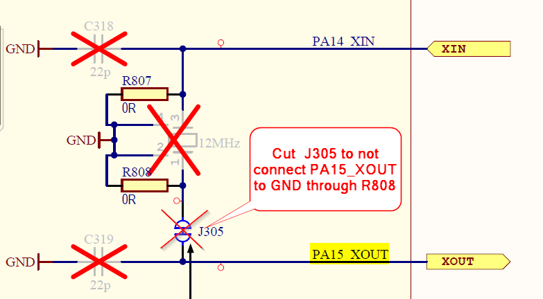
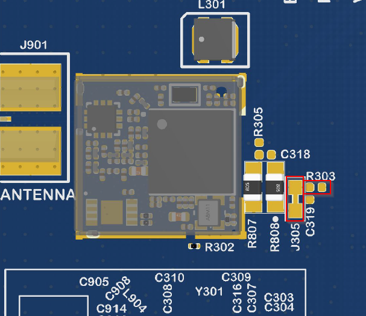
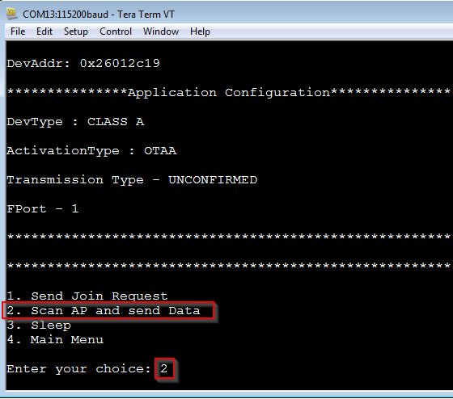

# ATSAMR34_LORAWAN_WIFI_AP_SCAN
> Adding WiFi Sniffing to an existing LoRaWAN Application

Based on LoRaWAN Mote Application generated from ASFv3, this sample code demonstrates the coexistence of a LoRaWAN Application and a pure radio communication between 2x ATSAMR34 Xplained Pro boards using LoRa modulation.

For more information on Microchip ATSAMR34 LoRa SiP and ATWINC1500 802.11b/g/n Network Controller devices, visit Microchip webpages: </br>
https://www.microchip.com/design-centers/wireless-connectivity/low-power-wide-area-networks/lora-technology/sam-r34-r35
https://www.microchip.com/wwwproducts/en/ATWINC1500



## Get a Microchip ATSAMR34 Xplained Pro evaluation kit

The ATSAMR34 Xplained Pro evaluation kit is a hardware platform used to evaluate the ATSAMR34 Low Power LoRa® Sub-GHz SiP. It is supported by Atmel Studio 7.0 IDE and a collection of sample codes are available from Advanced Software Framework (ASFv3) since the 3.44.0 release.
The Xplained Pro MCU series evaluation kit includes an on-board Embedded Debugger (EDBG), and no external tools are necessary to program or debug the ATSAMR34.
The kit offers a set of features that enable the user to get started with the ATSAMR34 Low Power LoRa® Sub-GHz SiP peripherals right away, and to understand how to integrate the device in your own design.
The ATSAMR34 Xplained Pro kit contains the following items:
- One ATSAMR34 Xplained Pro </br>
- One external antenna </br>


https://www.microchip.com/DevelopmentTools/ProductDetails/dm320111

## Get a Microchip ATWINC1500 Xplained Pro evaluation kit

The ATWINC1500-XPRO is an extension board to the Xplained Pro evaluation platform. The ATWINC1500-XPRO extension board allows you to evaluate the ATWINC1500 low cost, low power 802.11 b/g/n Wi-Fi network controller module. Supported by the Atmel Studio integrated development platform, the kit provides easy access to the features of the ATWINC1500 and explains how to integrate the device in a custom design.



https://www.microchip.com/DevelopmentTools/ProductDetails/ATWINC1500-XPRO

## Software

- Download and install Atmel Studio 7.0 IDE. </br>
https://www.microchip.com/mplab/avr-support/atmel-studio-7

- Open Atmel Studio 7.0 IDE. </br>
- Then, you need Advanced Software Framework (ASFv3) v3.45.0 release or upper release. </br>
Install ASFv3 as an extension to Atmel Studio from the menu: Tools -> Extensions and Updates …
- Once the installation is complete, you must restart Atmel Studio. </br>
- Download and install a serial terminal program like Tera Term. </br>
https://osdn.net/projects/ttssh2/releases/

Note: ASFv3 is an MCU software library providing a large collection of embedded software for AVR® and SAM flash MCUs and Wireless devices. ASFv3 is configured by the ASF Wizard in Atmel Studio 7.0 (installed as an extension to Studio). ASFv3 is also available as a standalone (.zip) with the same content as Studio extension (https://www.microchip.com/mplab/avr-support/advanced-software-framework).

Important:
Until the next Atmel Studio IDE release, you have to manually install the Device Part Pack for developing with SAMR34/R35 on Atmel Studio 7.0 IDE.
(all products released in between IDE releases of Atmel Studio should be manually added by user to develop applications).
- Go to Tools -> Device Pack Manager </br>
- Check for Updates </br>
- Search for SAMR34 and click install </br>
- Repeat the same for SAMR35 </br>
- Restart Atmel Studio 7.0 IDE </br>

## Hardware Setup

To demonstrate WiFi Sniffing over LoraWAN Network by connecting SAMR34-Xpro and ATWINC1500-Xpro, the connection is pretty straightforward through the EXT1 interface.



Note: If you have a ATSAMR34-Xpro Rev3 board (flip the board to check the revision), the EXT1_PIN10 marked PA23 on silkscreen is actually net to PA15.
General recommandation is to double check with the schematics of the board which is available in the Chip Down Design Package: 
https://www.microchip.com/wwwproducts/en/ATSAMR34J18

By default on the ATSAMR34-Xpro board Rev3, the pin PA15 of the chip is not connected. However, in order to perform power down mode of the ATWINC1500, you need to made this pin available over the EXT1_PIN10 connector. 
With that, the ATSAMR34 device will be able to drive the PIN10 of the WINC1500-Xro board. This pin corresponds to the CHIP_EN signal of the ATWINC1500 device.
High level on CHIP_EN pin enables the ATWINC1500 module and low level places module in Power-Down mode.
To be able to drive the ATWINC1500 CHIP_EN pin from the ATSAMR34 device, perform the following hardware modification on ATSAMR34-Xpro board:
- R303: Place a 0R Shunt
- J305: Cut the shunt






- In order to connect in LoRaWAN, you will need to be in range of your gateway. If you don’t have gateway, check the world map (https://www.thethingsnetwork.org/map) to see if your local community has gateway deployed around your location.
- Plug the antennas and always make sure you have the antennas plugged to your boards before powering it up. </br>
- Connect the ATWINC1500-Xpro extension board to the EXT1 connector of the ATSAMR34-Xpro board. </br>
- Connect the board to the PC through the micro-USB cables. </br>
USB cable must be connected to the EDBG USB connectors of the ATSAMR34 kit.
- Wait for USB driver installation and COM ports mounting. The USB ports powers the board and enables the user to communicate with the kits. </br>
- Launch Tera Term program and configure the serial ports mounted with: 115200 bps, 8/N/1 </br>

## LoRaWAN Mote Application + WiFi Sniffing

This project integrates the Microchip LoRaWAN Stack (MLS) Software API which provide an interface to the different software modules. </br></br>
This application is based on LoRaWAN Mote Application generated from ASFv3 and already contains the drivers required to interface the ATWINC1500 device (PORT, EXTINT, SPI, etc...).

The application has been modified to perform the following steps on demand: 

- Scan the nearby WiFi Access Point
- Select the two best signal strength from the devices discovered
- Transmit the payload containing RSSI level and BSSID (Broadcast MAC Address) of the Access Points selected through the LoRaWAN protocol to the network server.

It uses UART serial interface with 115200 bps 8N1 configuration and the UART is used to display the menu options. The user input is provided through keyboard.

## Provisioning the LoRaWAN activation parameters

- In Atmel Studio 7 IDE
- Open this project
- To activate your ATSAMR34 Xplained Pro board on a LoRa Network Server, you will be using the OTAA activation procedure. The OTAA method requires the following parameters to be embedded into the LoRaWAN Mote Application:
  </br>- AppEUI : Copy/Paste from your Network Server
  </br>- AppKey: Copy/Paste from your Network Server
  </br>- DevEUI: Serialized (Embedded) in the EDBG chip of the ATMSAMR34 Xplained Pro evaluation kit
</br></br></br>
The LoRaWAN Mote Application provides configurable parameters such as OTAA credentials in conf_app.h file. This file is available at <your project folder>/src/config.
- To provision your device, perform the following steps.
- From the "Solution Explorer" pane, expand the /src/config folders.
- Open the conf_app.h file.
The file contains the possible configuration related to the LoRaWAN Mote Application.
- Modify the values of the DEMO_APPLICATION_EUI and DEMO_APPLICATION_KEY macros with the AppEUI and AppKey you've collected from your Network Server.
```
	/* OTAA Join Parameters */
	#define DEMO_DEVICE_EUI                         {0xde, 0xaf, 0xfa, 0xce, 0xde, 0xaf, 0xfa, 0xce}
	#define DEMO_APPLICATION_EUI                    {0x00, 0x00, 0x00, 0x00, 0x00, 0x00, 0x00, 0x05}
	#define DEMO_APPLICATION_KEY                    {0x00, 0x00, 0x00, 0x00, 0x00, 0x00, 0x00, 0x00, 0x00, 0x00, 0x00, 0x00, 0x00, 0x00, 0x00, 0x05}
```
- By default, the LoRaWAN Mote Application uses the embedded DevEUI from the EDBG chip. You can use your own DevEUI by changing the value of the EDBG_EUI_READ macro located in the symbols definition and in conf_board.h file. Make sure the DevEUI is the same on both side: end-device and network server.

conf_board.h file:

	/* TODO: If Board is having EDBG with DEV_EUI flashed in
	Userpage Enable this Macro otherwise make it as 0 */
	#define EDBG_EUI_READ      1

## Configuring the WiFi AP Scan

This application provides configurable parameters related to the WiFi scanning.
There are two methods of scanning for active WiFi access points.
- Passive scan which turn the receiver ON and listen on each channel for the beacon.
This mode is completely anonymous. The scan is completely passive and nothing is transmitted from the WiFi device.
Most of the access points transmit beacon frames every ~100ms. So, while passive scanning, to ensure no beacons are missed, the WINC1500 device has to listen for at least 200 - 300ms per channel.
Depending the region, you can have 12 channels (or 14 in some areas) in the 2.4GHz band so a full scan would take 300 x 12 = 3.6 seconds
During this time, the receiver is active and battery life will be obviously impacted. It's an important point to consider for a battery powered application.

- Active scan which broadcast a "Who is there?" packet on each channel
In this mode, the WiFi device transmits a probe request on the currently tuned channel. An active scan slot time is 30ms by default which means for one scan request for a specific channel, every 30ms two probe requests are sent and this is retried 3 times by default.
One active scan slot has 2 probe requests which takes ~1ms which remains 29ms for reception.

The power requirement for Active scan is much lower - after the initial probe request, the adapter only listens for a fraction of time compared to a passive scan.
Thereby active scan is using to increase the battery life.


```
	/* This macro defines the WIFI AP SCAN MODE */
	#define PASSIVE_SCAN	1
	#define ACTIVE_SCAN		2
	#define DEMO_AP_SCAN_MODE	ACTIVE_SCAN

	/* This macro defines the time in ms that passive scan is listening for beacons on each channel per one slot */
	#define DEMO_PASSIVE_SCAN_TIMEOUT	300

	/* This macro defines the channel(s) to scan */
	#define DEMO_CHANNEL_TO_SCAN	M2M_WIFI_CH_ALL
```
	
## Tutorial

- Start Atmel Studio 7 IDE
- Open this project
- From the Atmel Studio menu, go to: Build -> Build Solution
- Flash the firmware on the ATSAMR34 Xplained Pro board
- Open a Tera Term session with 115200 bps 8N1 configuration.
- Reset the boards
- The application will start and on Tera Term the menu is displayed.</br>
- From here, you can interact with the application </br>
- From the first menu, select the Demo application.
- From the second menu and according to your regional band configuration, select the appropriate band.
- Then, the end-device will automatically try to join the network using the OTAA parameters you have modified previously in the code. You should observe a successful join message otherwise double check the OTAA keys on both side (end-device and Network Server) and send a Join Request from the menu.
- The third menu gives you the available options to scan AP and transmit data over your LoRaWAN Network
- LoRaWAN MAC Layer domain operations:
  </br>1. Send Join Request -> activate your device within a LoRaWAN Network
  </br>2. Scan AP and send Data -> transmit the selected AP to LoRaWAN Network
  </br>3. Sleep -> put the device in sleep mode
  </br>4. Main Menu -> go back to the main menu to select the regional band
- From the third menu displayed, select "Scan AP and send Data" if your device has correctly joined a LoRaWAN Network
</br></br> </br></br>
- The end-device will wake-up the WiFi device, scan the WiFi network around and report information about two of them: the one with the best signal.
- You can observe your board's uplink payload data by connecting to the dashboard of your Network Server.
- The backend server will be able to get a position from these information.
